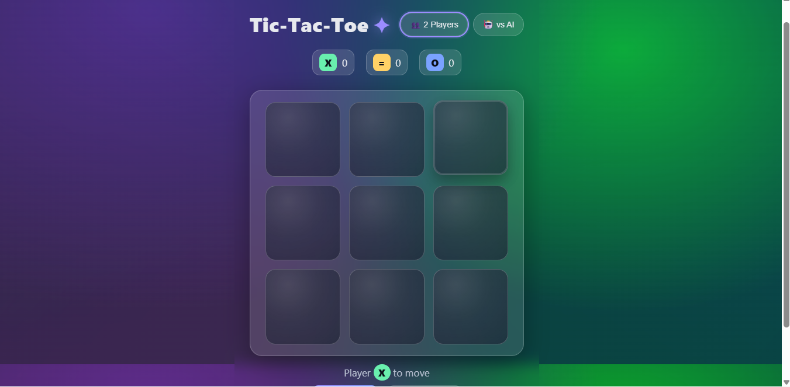

# 🎮 Tic-Tac-Toe Web App  

A modern, responsive **Tic-Tac-Toe game** built with **HTML, CSS, and JavaScript**.  
You can play either **Player vs Player** or **Player vs AI (Minimax Algorithm)** mode.  

---

## ✨ Features  

- 🎨 Beautiful & responsive UI  
- 🧑‍🤝‍🧑 **Two Player Mode**  
- 🤖 **AI Opponent (Perfect Play with Minimax)**  
- 🏆 Scoreboard tracking wins, losses & ties  
- 🔄 New round & Reset options  
- 📱 Works on desktop & mobile  

---

## 🚀 Live Demo  

👉 [Play Tic-Tac-Toe Online](#) *(add GitHub Pages link after deployment)*  

---

## 📷 Screenshots  

### Game Board  
  

### AI Mode  
  

---

## 🛠️ Installation  

1. Clone the repository  
   ```bash
   git clone https://github.com/your-username/tic-tac-toe.git
   cd tic-tac-toe
2.Open index.html in your browser.
(No server required, it’s pure HTML/JS/CSS)

🧠 How the AI Works

The AI opponent uses the Minimax Algorithm, which guarantees the best possible move every time.
This means:

It will never lose.

The best you can do is tie if you also play perfectly.

📂 Project Structure
tic-tac-toe/
├─ index.html
├─ style.css
├─ script.js
├─ preview.png
└─ README.md

## 📷 Screenshots  

### Game Board  
  

